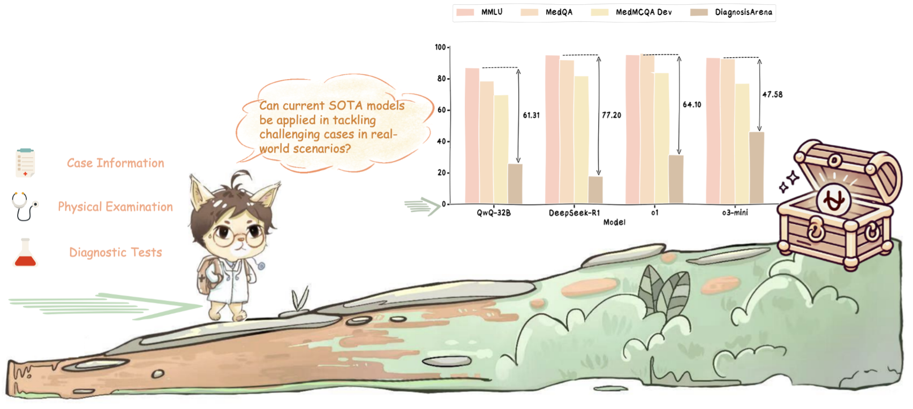
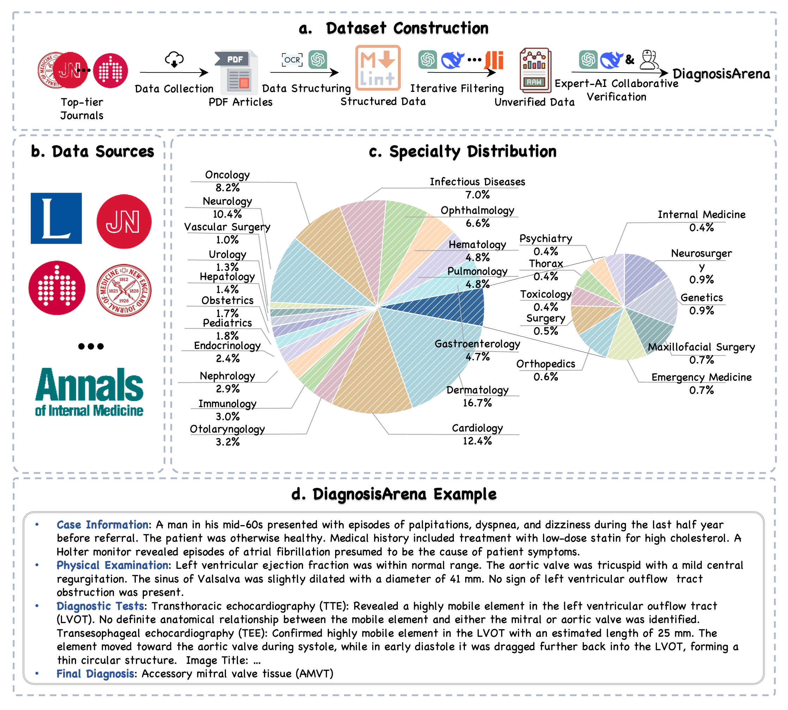

# DiagnosisArena: Benchmarking Diagnostic Reasoning for Large Language Models
<p align="center">        </p>


<p align="center">
  📄 <a href="https://arxiv.org/abs/2505.14107" target="_blank">Paper</a> &nbsp; | &nbsp;
  🤗 <a href="https://huggingface.co/datasets/SII-SPIRAL-MED/DiagnosisArena" target="_blank">Hugging Face</a> &nbsp; | &nbsp;
  📘 <a href="https://mp.weixin.qq.com/s/8uRDnWzT2I9IRq7djuvEqw" target="_blank">量子位</a> &nbsp; | &nbsp;
</p>


## 🔥News

- [2026/06/04] Our work is featured by [量子位](https://mp.weixin.qq.com/s/8uRDnWzT2I9IRq7djuvEqw) on Wechat!

  
## Contents

- [Introduction](#introduction)
- [How to use?](#how-to-use)
  - [Load Data](#load-data)
  - [Inference](#inference)
  - [Evaluation](#evaluation)
  - [Multi-Choice Question Evaluation](#multi-choice-question-evaluation)
- [Contact Us](#contact-us)
- [Citation](#citation)
- [Disclaimer and Terms of Use](#disclaimer-and-terms-of-use)

## Introduction

<p align="center">        </p>

**DiagnosisArena** is a comprehensive and challenging medical benchmark designed to assess the diagnostic reasoning abilities of LLMs in clinical settings. Through a meticulous construction pipeline, **DiagnosisArena** consists of 1,113 pairs of structured patient cases and corresponding diagnoses, spanning 28 medical specialties, deriving from clinical case reports published in 10 high-impact medical journals. The experimental results indicate that even the SOTA reasoning models perform relatively poorly on **DiagnosisArena**. Through **DiagnosisArena**, we aim to drive further advancements in AI’s diagnostic reasoning capabilities, enabling more effective solutions for real-world clinical diagnostic challenges.

## How to use?

### Load Data

We have released the data of the test set on [Hugging Face](https://huggingface.co/datasets/SII-SPIRAL-MED/DiagnosisArena). In the test split, it contains 1,000 instance including the answers for small-scale testing.

Loading the data is very simple. You can use the following code snippet:

```python
from datasets import load_dataset

# Load the dataset for the test split
dataset=load_dataset("SII-SPIRAL-MED/DiagnosisArena", split="test")

print(dataset[0])
```

Each data entry contains the following fields:

- `id`: The unique identifier for each problem.
- `Case Information`: The basic information about the patient, including demographic details and clinical history.
- `Physical Examination`: The objective anatomic findings through the use of observation, palpation, percussion, and auscultation.
- `Diagnostic Tests`: These include various exams that the patient undergoes, such as laboratory tests (e.g., blood and urine tests), imaging tests (e.g., mammography and CT scans), genetic tests, and more.
- `Final Diagnosis`: The definitive name of the patient's condition, expressed in a single term.
- `Options`: Four choices regarding the patient's condition.
- `Right Option`: The correct choice based on clinical evidence and guidelines.

### Inference

To perform inference, first navigate to the code directory:
```bash
cd code
```

Next, run the inference script using the following command:

```bash
python inference.py \
    --hf_data_path SII-SPIRAL-MED/DiagnosisArena \
    --model_name gpt-4o \
    --output_path ./results/model_answer.jsonl \
    --api_key YOUR_API_KEY \
    --base_url YOUR_BASE_URL \
    --folk_nums 16
```

### Evaluation

You need to provide a model to serve as the evaluation judge. Then, run the following code, which will evaluate the inference results (please make sure the path to your inference results is correctly specified):

```bash
python evaluation.py \
    --input_path ./results/model_answer.jsonl \
    --output_path ./results/model_answer_evaled.jsonl \
    --model_name gpt-4o \
    --api_key YOUR_API_KEY \
    --base_url YOUR_BASE_URL \
    --folk_nums 16
```
After the evaluation, you can run this code to obtain the detailed Top-k metric results.

```bash
python metric.py \
    --model_name gpt-4o \
    --metric_path ./results/model_answer_evaled.jsonl
```

### Multi-Choice Question Evaluation

If you would like to evaluate the DiagnosisArenaMCQ dataset, the process is similar to the one described above. You can start by running the inference and then compute the evaluation metrics.

First, run the inference script with the following command:
```bash
python inference_mcq.py \
    --hf_data_path SII-SPIRAL-MED/DiagnosisArena \
    --model_name gpt-4o \
    --output_path ./results/model_mcq_answer.jsonl \
    --api_key YOUR_API_KEY \
    --base_url YOUR_BASE_URL \
    --folk_nums 16
```

Next, run the metric evaluation script:
```bash
python metric_mcq.py \
    --model_name gpt-4o \
    --metric_path "./results/model_mcq_answer.jsonl"
```

## Contact Us

If you are interested in our project and would like to join us, feel free to send an email to [xiaofan.zhang@sjtu.edu.cn](mailto:xiaofan.zhang@sjtu.edu.cn).

## Citation

If you do find our code helpful or use our benchmark dataset, please cite our paper.

```
@article{zhu2025diagnosisarena,
  title={DiagnosisArena: Benchmarking Diagnostic Reasoning for Large Language Models},
  author={Zhu, Yakun and Huang, Zhongzhen and Mu, Linjie and Huang, Yutong and Nie, Wei and Zhang, Shaoting and Liu, Pengfei and Zhang, Xiaofan},
  journal={arXiv preprint arXiv:2505.14107},
  year={2025}
}
```

## Disclaimer and Terms of Use

This dataset is adapted from publicly available literature, including publications from Cell, JAMA, and similar sources. All case data has been de-identified.

**This dataset is provided for research and model evaluation purposes only. It must not be used for clinical decision-making or medical diagnosis.**

