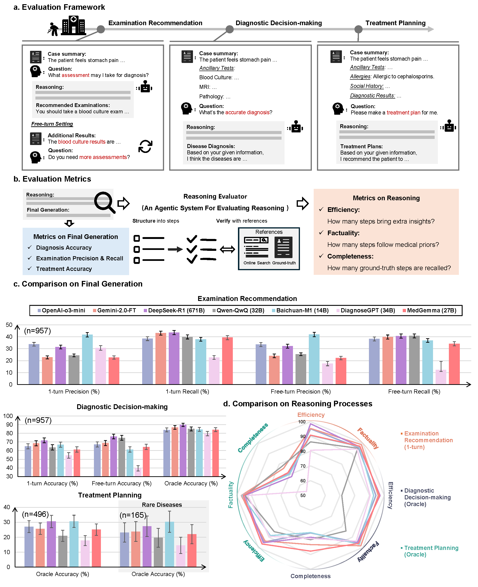

# MedR-Bench 
The official code for "Quantifying the Reasoning Abilities of LLMs on Real-world Clinical Cases".

[Paper (Nature Communications)](https://www.nature.com/articles/s41467-025-64769-1)

[Paper (Arxiv version)](https://arxiv.org/abs/2503.04691)

[Snapshots of searched websites](https://huggingface.co/datasets/Henrychur/MedRBench-Knowledge-Snapshots)

## Introduction
In this paper, we assess the quality of reasoning processes in Large Language Models (LLMs) within real-world medical contexts. Our contributions are as follows:

1. We present the first quantitative analysis focused on **LLM reasoning process quality** in clinical scenarios—a domain inherently rich with ground-truth reasoning processes such as differential diagnosis. Our evaluation encompasses cutting-edge reasoning models, including Deepseek-R1, OpenAI's o3-mini, and others.
2. We have developed **MedR-Bench**, a benchmark for evaluating reasoning performance based on PMC-OA case reports. This benchmark is specifically designed to mirror the complexities of authentic clinical scenarios.
3. We introduce an innovative agentic system, the **Reasoning Evaluator**, engineered to automate and objectively quantify free-text reasoning responses in a scalable and efficient manner.



## Files Organsization
```
├── data/
│   └── MedRbench/            # Contains comprehensive medical benchmark datasets
│   └── InferenceResults/     # Stores structured model outputs from experimental runs
├── src/
│   └── Evaluation/           # Tools for assessing model reasoning quality 
|          └── Metrics/       # Detailed metrics implementation
│   └── Inference/            # Modular inference pipelines supporting multiple LLM backends
├── README.md                 # Project overview, setup instructions, and usage guidelines
```
## How to use
### 1. Environment Setup
Since this project uses Selenium to simulate browser-based internet searches, you need to install Selenium:
```
pip install selenium
```

You'll also need to prepare the appropriate API keys. In the Inference module, modify the constants in the respective Python files according to your service provider and API key. For example:
```
GEMINI_URL = 'https://aigptapi.com/v1/'
GEMINI_API_KEY = 'YOUR_API_KEY'
```
For the Evaluation component, add your GPT API key to the `Evaluation/metrics/gpt_key.txt` file. Note that the evaluation process heavily relies on GPT-4o for assessment, which may consume a significant amount of API credits.

### 2. Inference
The inference section contains four files. Running different files will invoke specific models to perform inference under various settings:
- `oracle_diagnose.py` Diagnostic task where the model receives complete patient information (including auxiliary examination results) and makes a diagnosis.
- `one_turn.py` Diagnostic task where the model receives basic patient information, performs one round of assessment recommendation, and then makes a diagnosis based on the assessment results.
- `free_trun.py` Diagnostic task where the model receives basic patient information, performs multiple rounds of assessment recommendations until it determines it has sufficient information, and then makes a diagnosis.
- `oracle_treatment_planning.py` Treatment task where the model receives complete patient information and develops a treatment plan.

For example, to run **oracle diagnose** for all six models:
```
python oracle_diagnose.py
```


### 3. Evaluation
The evaluation section assesses the inference results from the models. The evaluation code is located in `Evaluation/metrics/` and includes:
- `outcome_accuracy_eval.py` Calculates the final accuracy of model outputs. You can choose whether to use web search.
- `reasoning_eval.py` Evaluates the efficiency, factuality, and completeness of the model's reasoning process, requiring web search.
- `assessment_recommendation_eval.py` Calculates precision and recall of model assessment recommendations.

We also provide example usage of the evaluation code in the Evaluation directory:
- `oracle_diagnose_accuracy.py`
- `oracle_diagnose_reasoning.py`
- `1turn_diagnose_accuracy.py`
- `1turn_reasoning.py`
- `1turn_assessment_recommendation.py`
- `free_turn_diagnose_accuracy.py`
- `free_turn_assessment_recommendation.py`
- `treatment_final_accuracy.py`
- `treatment_reasoning.py`

Here's an example command for running the treatment accuracy evaluation:
```
python treatment_final_accuracy.py \
    --model deepseek-r1 \
    --output-dir YOUR_OUTPUT_DIR \
    --patient-cases data/MedRBench/treatment_496_cases_with_rare_disease_165.json \
    --model-outputs data/InferenceResults/treatment_planning.json
```

## Contact
If you have any question, please feel free to contact qiupengcheng@pjlab.org.cn.

## Citation
```
@article{qiu2025quantifying,
  title={Quantifying the Reasoning Abilities of LLMs on Real-world Clinical Cases},
  author={Qiu, Pengcheng and Wu, Chaoyi and Liu, Shuyu and Zhao, Weike and Zhang, Ya and Wang, Yanfeng and Xie, Weidi},
  journal={arXiv preprint arXiv:2503.04691},
  year={2025}
}
```

